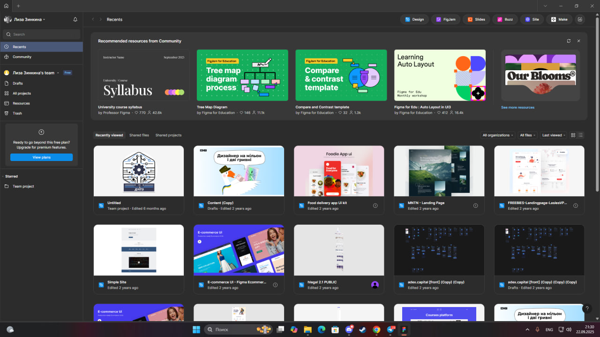
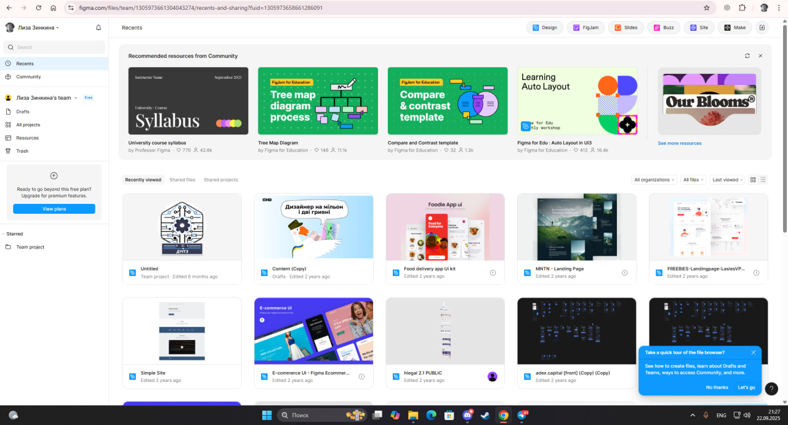
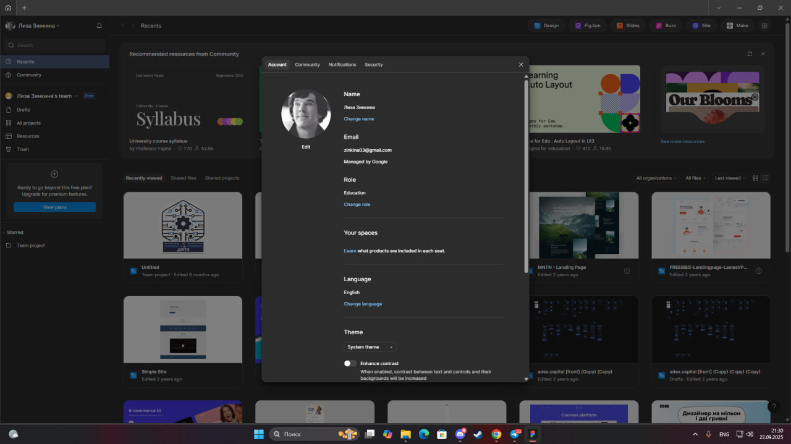

# **Практичне заняття 1 – Огляд сервісів для прототипування**
## **Хід роботи:**

Щоб завантажити настільну версію **Figma**, спершу потрібно перейти на офіційний сайт [figma.com](https://www.figma.com/) і пройти реєстрацію.  
Після цього відкриється веб-версія редактора, яка працює прямо у браузері.  
Якщо натиснути на аватар користувача у верхньому лівому куті, з’явиться меню, де можна змінити налаштування профілю та завантажити **desktop-версію Figma**.

### **Так виглядає декстопна версія фігми**

### **Так виглядає веб-версія**

### **Так виглядає аккаунт користувача**

### Висновок  
У процесі роботи я навчилась:  
- реєструватися та користуватися веб-версією Figma;  
- знаходити й завантажувати desktop-версію програми;  
- працювати з основними налаштуваннями профілю. 
