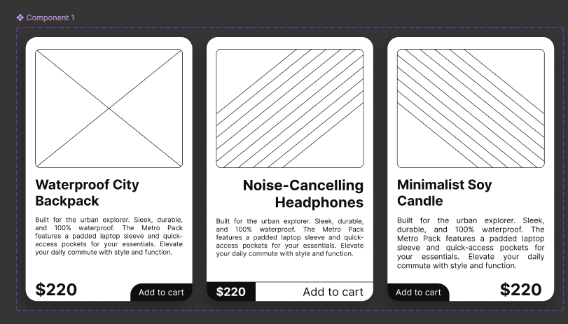
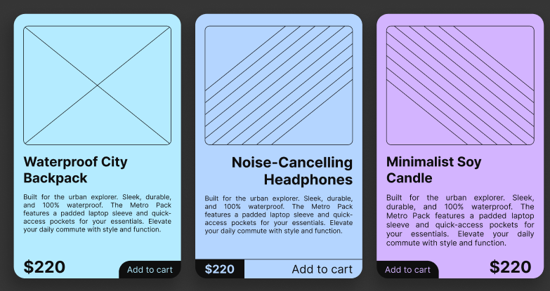
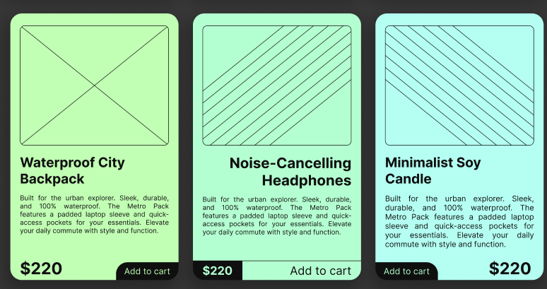
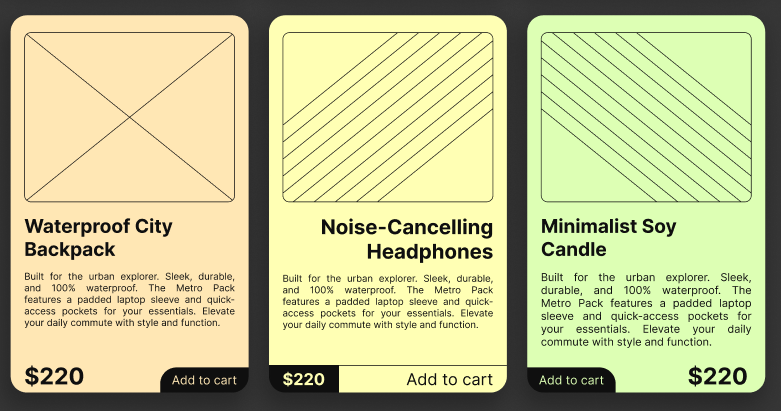
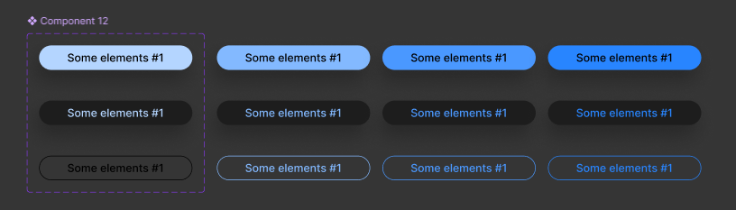

# Practical Task 10. Components and Variants in Figma

## **Overview**
This practical task focuses on mastering **Components** and **Variants** in Figma. The main goal was to practice creating a reusable component structure and then applying different visual styles to achieve design variety.

## **Tools**
- **Figma** (Components, Variants, Properties, Auto Layout)

## **Implementation Process**

### **1. Creating Atomic Elements (Buttons)**
I started by creating a set of button components to be used within the cards.
- Designed different states (Default, Hover, Pressed).
- Created different styles (Filled vs. Outlined) to be easily swappable within the main layout.

### **2. Building the Base Component**
I designed the master component for the product card using **Auto Layout**.
- The initial version was created in a clean, neutral style (White background) to establish the correct hierarchy of elements: Image, Title, Description, Price, and Action Button.

### **3. Design Experiments & Visual Variations**
Once the logic was set, I used **Variants** to create multiple design iterations. The goal was to experiment with different backgrounds, strokes, and color combinations to see how diverse the cards could look while keeping the same structure.

**Variation Set 1: High Contrast**
Experimenting with solid colors and high-contrast outlines to give the cards a bold look.

**Variation Set 2: Bright & Vibrant**
Testing how the component looks with brighter, neon-like background colors.

**Variation Set 3: Soft & Pastel**
A version with softer background tones to create a lighter, more approachable aesthetic.

---

## **Key Results**
1. **Flexibility:** Proved that a single master component can be transformed into completely different visual styles using Variants.
2. **Consistency:** Despite the different visual styles, all cards maintain consistent padding and alignment thanks to Auto Layout.
3. **Scalability:** The setup allows for adding new design styles quickly without rebuilding the card from scratch.

---

### **Figma Project Link**
https://www.figma.com/design/iv7eoImP1FnO0yyaeRbWOm/10?node-id=0-1&t=NDfy8463XTzwtFQJ-1