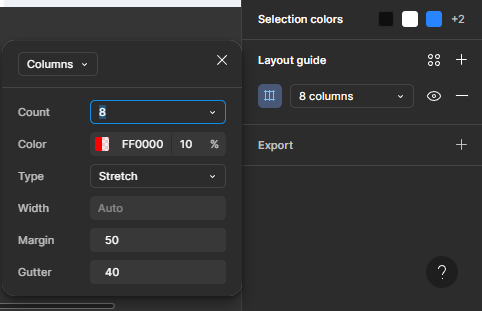
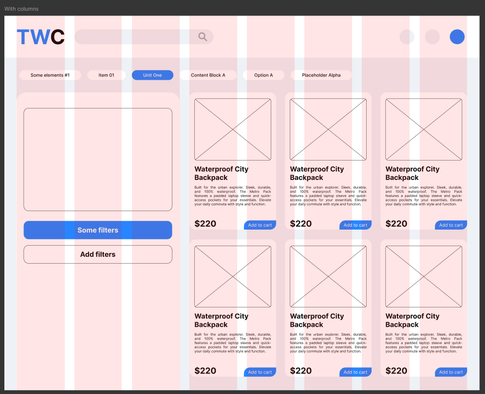
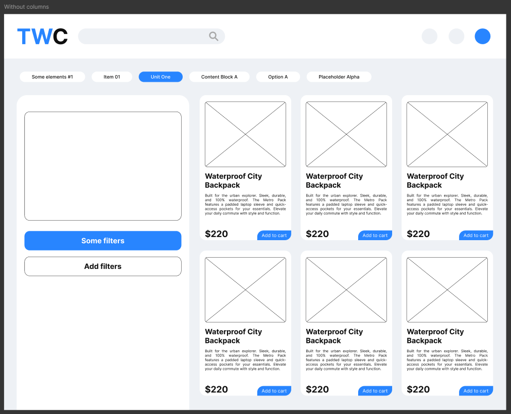

# Practical Task: Grid Systems in UI Design

## **Overview**
The objective of this task was to master **Layout Grids** in Figma. The main goal was to structure a web interface (an e-commerce catalog) using a column grid to ensure proper alignment, consistency, and responsiveness of UI elements.

## **Tools**
- **Figma** (Layout Grid, Guides, Constraints, Auto Layout)

## **Implementation Process**

### **1. Grid Configuration**
I started by setting up a responsive grid system for a desktop frame.
- **Columns:** I selected an **8-column** grid, which offers flexibility for placing cards (e.g., 2, 3, or 4 items per row).
- **Properties:**
  - **Type:** Stretch (to adapt to screen width).
  - **Margins:** 50px (spacing from the screen edges).
  - **Gutter:** 40px (space between columns).

### **2. Aligning Content to the Grid**
Once the grid was established, I placed the interface elements:
- **Header:** The logo and navigation elements were aligned to the outer edges of the grid.
- **Filters:** The horizontal filter bar spans across specific columns to maintain structure.
- **Product Cards:** The catalogue grid was arranged so that each card occupies a specific number of columns, ensuring equal spacing between them without manual measurement.

*Below is the view with the Layout Grid toggle turned ON:*

### **3. Final Interface (Clean View)**
After aligning all elements, I hid the grid to verify the visual balance. The result is a clean, structured interface where "white space" is used effectively, and all elements feel connected.

*Below is the final result without the visual guides:*

---

## **Key Results**
1. **Structure:** Learned how to build a solid foundation for UI design using mathematical grids rather than placing elements randomly.
2. **Alignment:** Achieved perfect vertical alignment for the Logo, Search Bar, and Content Blocks.
3. **Consistency:** The 8-column system allowed for a balanced distribution of the product cards (3 cards per row).

---

### **Figma Project Link**

https://www.figma.com/design/RHRFq5l2y1mVm6aKgEiIu4/11?node-id=0-1&t=ykJ3IJ9xM1x5ralv-1
