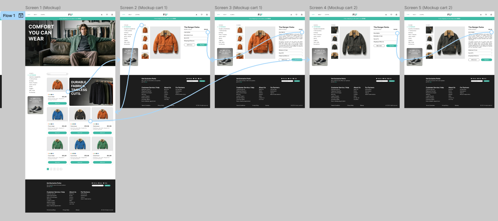

# Practical Task 12. Developing Wireframes and Prototypes

## **Overview**
The goal of this practical task was to design a comprehensive user experience for an online store. The process involved moving from low-fidelity structure planning to high-fidelity visual design and finally connecting the screens into an interactive prototype.

**Task Requirements:**
1. Create a detailed wireframe for an online store (Main page + 2-3 product pages) for Desktop.
2. Use prototyping tools to create a clickable prototype based on the design.

## **Tools**
- **Figma** (Design, Wireframing, Prototyping)

---

## **Workflow & Implementation**

### **1. Low-Fidelity Wireframing**
I started by building the skeleton of the website using wireframes. The focus here was on layout, spacing, and information architecture without the distraction of colors or images.

**Main Catalog Page (Wireframe):**
I defined the header, a layout for the hero section, a sidebar for filters (categories, price), and a grid system for product cards.
.jpg)

**Product Detail Page (Wireframe):**
I structured the single product page with a large image area, a dedicated section for product details (price, description, size selector), and a "Buy" call-to-action block.
.jpg)

---

### **2. High-Fidelity UI Design (Mockups)**
After approving the structure, I applied the visual style. I chose a "Clothing & Outerwear" theme ("F&F") with a clean, minimalist aesthetic using a teal accent color.

**Main Page Design:**
Filled with real content, high-quality imagery, and styled typography to create an engaging shopping experience.
.jpg)

**Product Page Variations:**
I designed specific pages for different product color options to simulate a real e-commerce experience.

*Variant 1: Orange/Brown Jacket (The Ranger Parka)*
.jpg)
.jpg)

*Variant 2: Dark Green Jacket (The Ranger Parka)*
.jpg)
.jpg)

---

### **3. Prototyping**
The final step was connecting the screens to create a user flow. I used Figma's **Prototype** tab to link the Main Page product cards to their respective Product Details pages.

**Flow Overview:**
- **Trigger:** Click on a product card.
- **Action:** Navigate to the specific product screen.
- **Animation:** Smart Animate / Dissolve for smooth transitions.

*Below is the connection map showing the interaction logic:*

---

## **Key Results**
1. **Wireframing:** Learned to ignore visual details initially to focus on UX and layout structure.
2. **Visual Design:** Transformed a skeletal wireframe into a polished, professional UI.
3. **Prototyping:** Successfully linked multiple screens to create a navigable representation of the final website.

---

### **Figma Project Link**
https://www.figma.com/design/9FWEyTRT8C1hZl3n6uu3wW/12?node-id=0-1&t=XGLaG6AD4HSFwsMV-1
