# Practical Task 13

## Topic
Researching color harmonies and color analysis tools in Adobe Color.

## Objectives
1. Familiarize with the concept of color harmony and main types of color combinations.
2. Learn to use the color wheel to build palettes based on different harmony principles.
3. Explore the capabilities of automatically extracting color palettes and gradients from images.
4. Learn to check contrast ratios of color pairs according to accessibility standards (WCAG).
5. Reinforce skills in documenting and analyzing color work in Markdown format.

## Theoretical Part
**What is color harmony?**
Color harmony is the theory of combining colors in a fashion that is harmonious to the eye. It is used to enhance emotional impact and interface readability.

**Harmony Types:**
* **Analogous:** Neighboring colors on the wheel — calm, soft palette.
* **Monochromatic:** Variations of a single hue (saturation/brightness) — clean, minimalist.
* **Triad:** Three colors evenly spaced — lively and colorful.
* **Complementary:** Opposite colors — high contrast and accent.
* **Split Complementary:** Base + two neighbors of the opposite — less aggressive contrast.
* **Square:** Four colors evenly spaced — variety, balance.
* **Custom:** Custom approach.

**WCAG (Contrast):**
* **Levels:** AA (normal text ≥ 4.5:1), AAA (normal text ≥ 7:1).

---

## Practical Part

### 1. Base Color
- **Base Color:** `#F52A14`

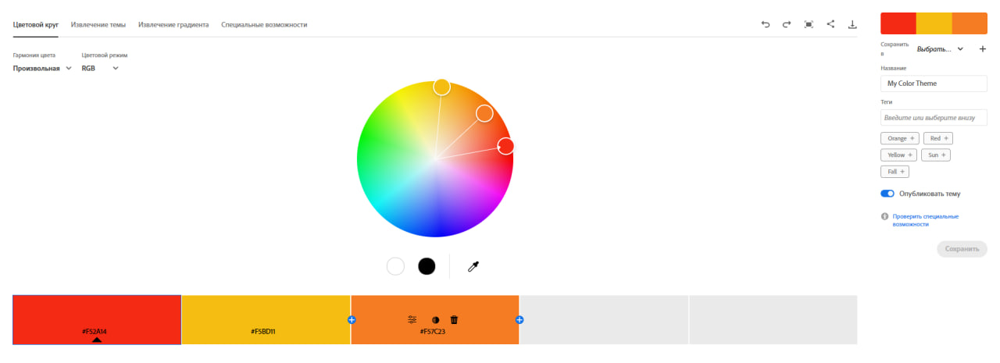

### 2. Palettes by Harmony Type

#### Analogous
- **HEX:** `#F52F2C`, `F5C630`, `F57B25`, `#F5A72B`, `#FA5629`
- **Logic:** Uses adjacent hues on the color wheel.
- **Emotional Effect:** Calmness, harmony, softness, compositional integrity.

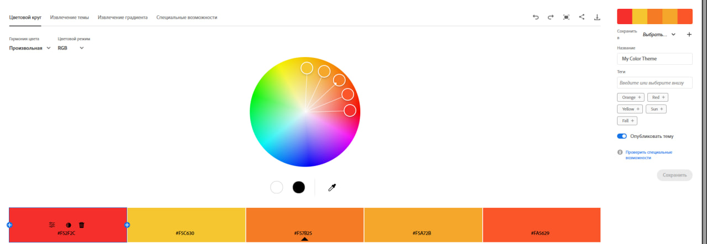

#### Monochromatic
- **HEX:** `#F5DACC`, `#F4B797`, `#F59968`, `#F57935`, `#FA5800`
- **Logic:** One color with varying brightness/saturation.
- **Emotional Effect:** Minimalism, restraint, cleanliness, and neatness.

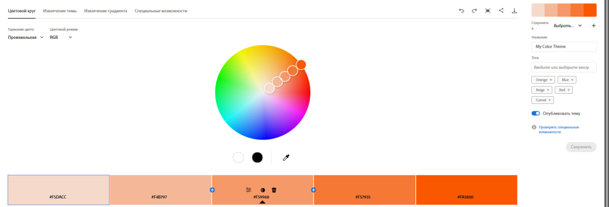

#### Triad
- **HEX:** `#9CF552`, `#F56536`, `#516CF5`
- **Logic:** Three colors spaced 120° apart.
- **Emotional Effect:** Energy, dynamism, brightness, cheerfulness.

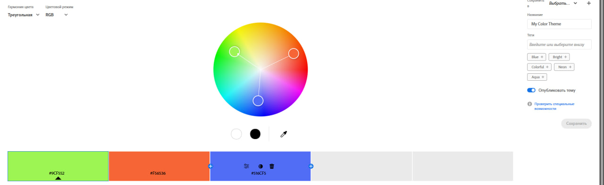

#### Complementary
- **HEX:** `#F53920`, `#EB796A`, `#FFCAC3`, `#21D677`, `#A9CEBB`, `#63D69A`
- **Logic:** Opposite colors on the wheel.
- **Emotional Effect:** Strong contrast, tension, highlighting attention.

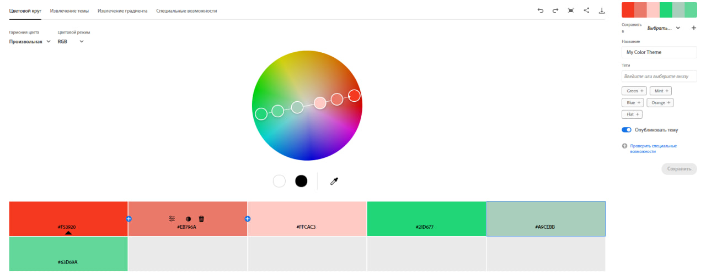

#### Split Complementary
- **HEX:** `#F50B34`, `#DC6B7F`, `#18F4D3`, `#72CCBD`, `#C9F50A`, `#DCEB7D`
- **Logic:** Softer contrast than standard complementary.
- **Emotional Effect:** Balanced contrast, brightness without harshness.

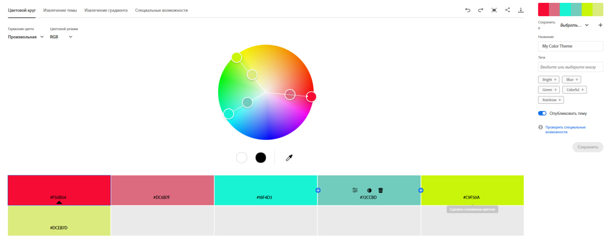

#### Square
- **HEX:** `#F50A35`, `#0A35F5`, `#F5B901`, `#0AF534`
- **Logic:** 4 colors spaced at equal intervals.
- **Emotional Effect:** Variety, complexity, balance between active colors.

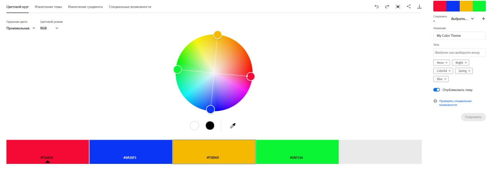

#### Custom
- **HEX:** `#F50A35`, `#AD40E1`, `#0A35F5`, `#E58348`, `#42C9D1`, `#F5B901`, `#0AF534`, `#D3E657`
- **Logic:** Custom construction based on aesthetic balance.
- **Emotional Effect:** Individuality, creativity, modern mood.

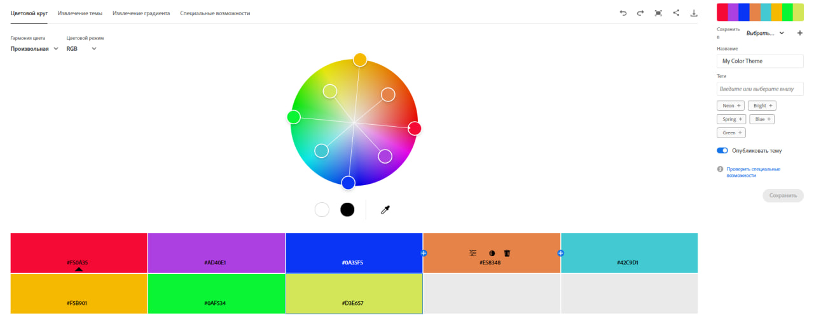

### 3. Extract Theme
**Image used:** 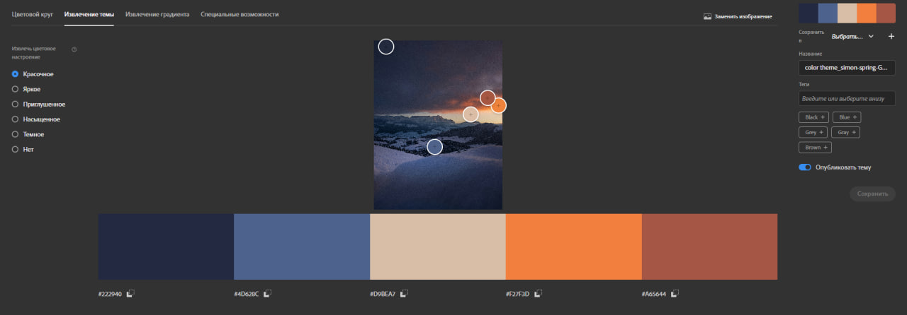

- **Colorful Palette:**
  - HEXs: `#222940`, `#4D628C`, `#D9BEA7`, `#F27F3D`, `#A65644`
  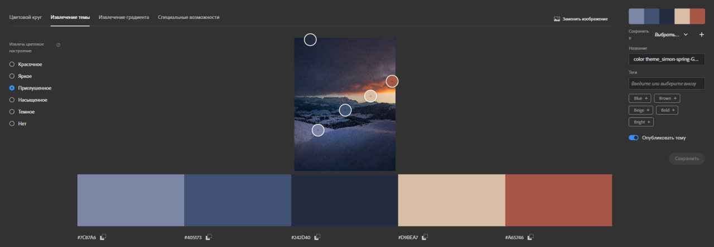

- **Muted Palette:**
  - HEXs: `#7C87A6`, `#405173`, `#242D40`, `#D9BEA7`, `#A65746`
  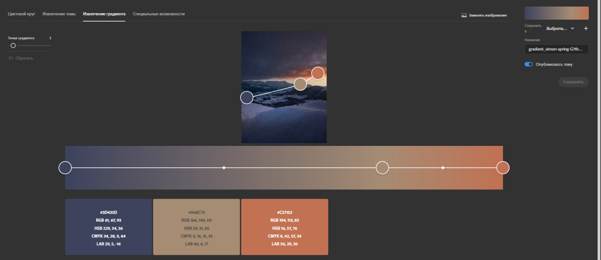

**Which palette fits UI better:** [Write "Muted" or "Colorful" here]
**Explanation:** [Briefly explain why, e.g., "The Muted palette is better for UI because the colors are calm and do not strain the user's eyes..."]

### 4. Extract Gradient
- **Gradient stops:** `#3D435D`, `#A68C73`, `#C27153`
- **Application:** This gradient can be used for the website's hero section or buttons.

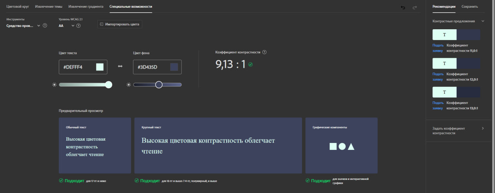

### 5. Accessibility (Contrast)
- **Color Pair:** Background `#DEFFF4`, Text `#3D435D`
- **Contrast Ratio:** `9,13 : 1`
- **AA (Normal):** Pass/Fail
- **AAA (Large):** Pass/Fail

---

## Conclusion
During this practical task, I familiarized myself with the concept of color harmony. I learned how to work with the color wheel in Adobe Color and create palettes based on different principles: Analogous, Monochromatic, Triad, Complementary, Split Complementary, Square, and Custom.

I gained practical skills in automatically extracting palettes from images (Extract Theme), comparing Colorful and Muted options. I also learned to create gradients using the Extract Gradient tool.

Additionally, attention was paid to checking color contrast according to WCAG accessibility standards, which is crucial for creating high-quality and user-friendly interfaces.