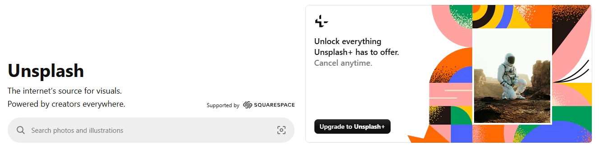

# Workshop_14

## Topic
Image optimization using Squoosh.

## Objective
1. Familiarize with image compression methods and their impact on quality.
2. Learn to determine the optimal balance between image quality and file size.
3. Understand different types of compression: lossless and lossy.
4. Investigate the impact of resizing on image quality and file weight.
5. Learn to adapt images for different target applications:
   - Web (optimization for fast loading).
   - Mobile devices (reduced dimensions, effective compression).
   - Retina displays (2x, 3x versions to preserve quality).
6. Reinforce skills in documenting and analyzing results in Markdown format within a GitHub repository.

## Theoretical Part

**What is Squoosh and how does it work?**
Squoosh is a free online tool for image compression and optimization. It runs directly in the browser and requires no software installation.

**Squoosh Workflow:**
1. The user uploads an image.
2. Selects the format and compression type.
3. Adjusts quality levels, dimensions, etc.
4. Downloads the optimized file to the computer.

### Image Formats and Compression Types

**Lossless Compression**
With this compression, image quality does not deteriorate; only the file size changes.
* **Main Formats:**
    * **PNG:** High-quality lossless format, often used for screenshots and graphics with text.
    * **WebP:** Modern lossless format, lighter than PNG.
* **Pros:** Full preservation of quality.
* **Cons:** File size is larger compared to lossy compression.

**Lossy Compression**
With this compression, some image details are lost, but the file size is significantly reduced.
* **Main Formats:**
    * **MozJPEG:** Optimized JPEG for the web.
    * **WebP (lossy):** Modern format with a good balance of quality and size.
    * **AVIF:** Newest format with very strong compression.
* **Pros:** Very small file size.
* **Cons:** Artifacts may appear at low quality settings.

### Image Resizing and Its Impact
**Resize** refers to reducing or increasing the width and height of an image.
* **Reducing size:** The file becomes significantly lighter, loads faster on websites, and quality loss is minimal.
* **Increasing size:** Sharpness may deteriorate, and the file becomes heavier.
* **Web Recommendation:** Do not upload images larger than necessary for display on the screen.

### Optimization for Retina Displays
Retina displays have high pixel density. If a standard 1x image is shown, it looks blurry. Therefore, specific versions are used:
* **2x:** Twice as large.
* **3x:** Three times as large.

### Adaptive Images in Web (srcset)
`srcset` is a special HTML attribute that allows the browser to automatically select the appropriate image version based on:
* Screen size.
* Pixel density.
* Device type.

Thanks to `srcset`, lightweight photos load on weaker devices, while high-quality ones load on Retina screens, making the site faster and more efficient.

---

## 1. Initial Images

| Type | File | Format | Size |
|------|--------|--------|--------|
| Photo | Yard.png | PNG | 473 KB |
| Screenshot | Screenshot.png | PNG | 161 KB |
| Graphics with text | Text.png | PNG | 21.0 KB |

---

## 2. Lossless Compression

### Photo
- PNG → 405 KB → `Yard_lossless.png`
- WebP → 28.7 KB → `Yard.webp`

### Screenshot
- PNG → 135 KB → `Screenshot_lossless.png`
- WebP → 25.7 KB → `Screenshot.webp`

### Graphics
- PNG → 11.8 KB → `Text_lossless.png`
- WebP → 11.7 KB → `Text.webp`

---

## 3. Lossy Compression

### Photo

| Format | 100% | 75% | 50% |
|--------|------|------|------|
| MozJPEG | 299 KB | 36.0 KB | 22.9 KB |
| WebP | 121 KB | 28.7 KB | 20.8 KB |
| AVIF | 153 KB | 40.4 KB | 18.7 KB |

### Screenshot

| Format | 100% | 75% | 50% |
|--------|------|------|------|
| MozJPEG | 168 KB | 33.9 KB | 23.5 KB |
| WebP | 65.2 KB | 25.7 KB | 20.8 KB |
| AVIF | 61.6 KB | 26.6 KB | 16.2 KB |

### Graphics

| Format | 100% | 75% | 50% |
|--------|------|------|------|
| MozJPEG | 1.43 KB | 904 B | 1.00 KB |
| WebP | 11.7 KB | 11.7 KB | 11.7 KB |
| AVIF | 30.2 KB | 17.6 KB | 12.7 KB |

---

## 4. Resizing

### Photo

| Version | File | Size |
|--------|--------|--------|
| Mobile 600px | Yard_bJPEG_600.jpg | 506 KB |
| Web 1200px | Yard_bJPEG_1200.jpg | 1.35 MB |
| Retina 2400px | Yard_bJPEG_retina_2400.jpg | 3.82 MB |

### Screenshot

| Version | File | Size |
|--------|--------|--------|
| Mobile 600px | Screenshot_bJPEG_600.jpg | 60.7 KB |
| Web 1200px | Screenshot_bJPEG_1200.jpg | 182 KB |
| Retina 2400px | Screenshot_bJPEG_retina_2400.jpg | 509 KB |

### Graphics

| Version | File | Size |
|--------|--------|--------|
| Mobile 600px | Text_bJPEG_600.jpg | 23.4 KB |
| Web 1200px | Text_bJPEG_1200.jpg | 9.52 KB |
| Retina 2400px | Text_bJPEG_retina_2400.jpg | 35.6 KB |

---

## 5. Image Comparison

### Photo

#### Original

#### Optimized (Moz JPEG 50%)

---

### Screenshot

#### Original

#### Optimized (Moz JPEG 50%)

---

### Graphics with text

#### Original

#### Optimized (Moz JPEG 50%)

*Comparison:*  
Comparison of Optimization Results The optimization using MozJPEG at 50% quality significantly reduced the file sizes but introduced distinct visual changes depending on the image type. For the photograph (Yard), the compression was highly effective, retaining the overall atmosphere with only a minor loss of fine detail. However, the graphic images (Screenshot and Text) suffered from noticeable compression artifacts, such as "ringing" noise around the sharp text edges. Additionally, since the JPEG format does not support transparency, the transparent background in the Text image was replaced with a solid black fill, making this format less suitable for graphics requiring transparent elements.

## Conclusion

During this practical task, I learned how to work with Squoosh, perform both lossy and lossless image compression, and resize images for various devices. I observed how significantly WebP and AVIF formats reduce file size without substantial loss of quality. For the web, WebP and AVIF are the best choices; for screenshots, PNG and WebP (lossless) are preferred; and for Retina displays, it is crucial to create scaled-up 2x or 3x versions.