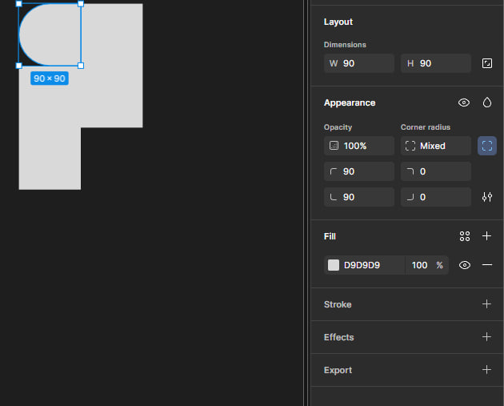
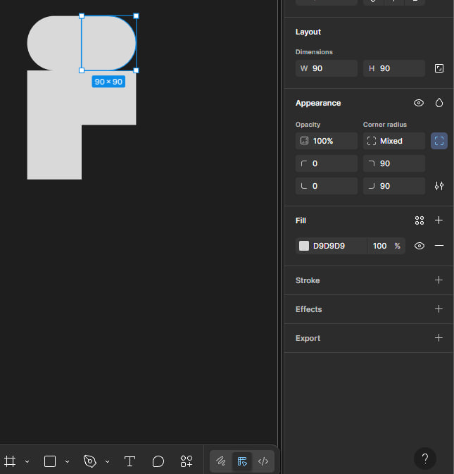
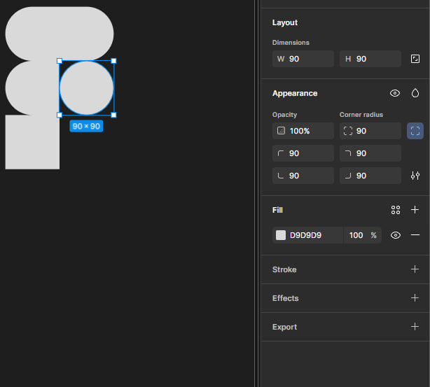
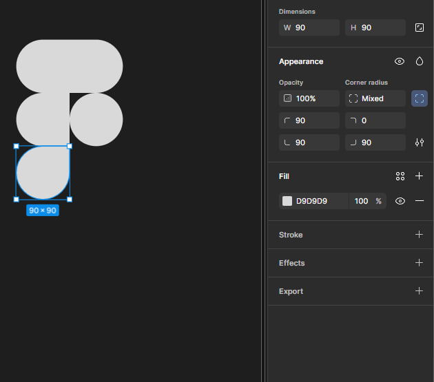
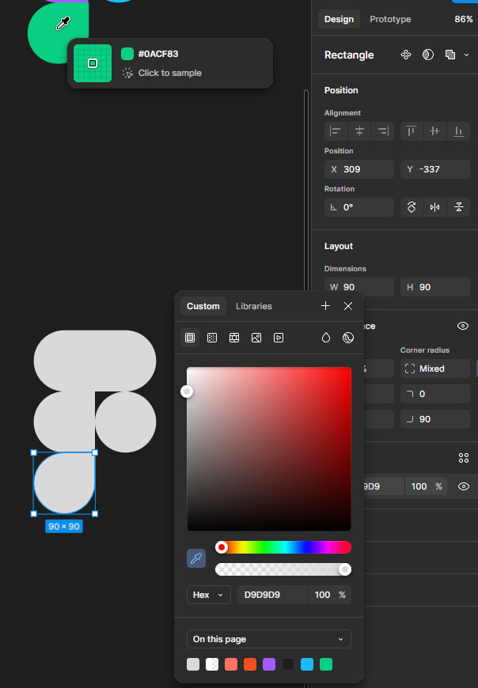
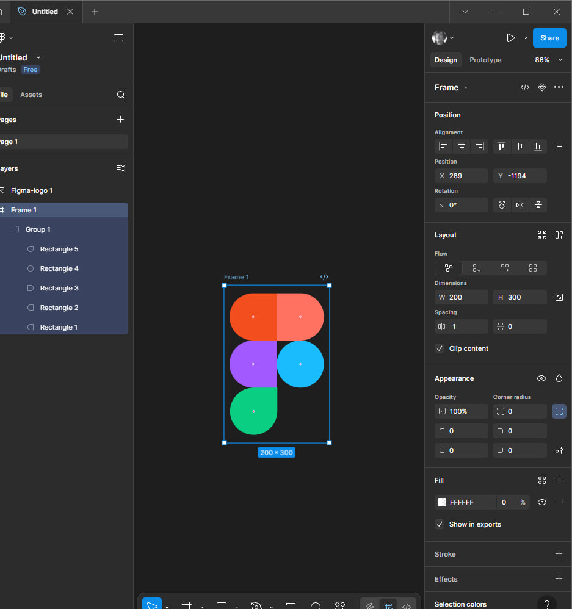

# PT-2 Working with simple shapes and their properties in Figma. Part 1 
## Work plan:
#### 1) *I created a new project in Figma. Then I created five 90x90 polygons. After that, I started editing each shape. For example, for one shape, I smoothed the corners using these parameters:*  
 
 #### 2) *For the second figure:* 
 
#### 3) *For the third figure I repeated the same as on the first one.* 

 #### 4) *For the fourth figure I used these properties to make a circle:* 
 
#### 5)  *And for the last figure these are the properties:* 

#### 6)  *Next, I moved on to coloring. For this, I copied the logo that was given in the assignment and, using an eyedropper, chose the right colors:* 

#### 7)  *I also created a frame measuring 200 by 300, set the transparency to zero and moved the previously grouped shape there using the ctrl+g combination.*  
    
 ## Conclusion
While working in Figma, I learned to:
-   create a logo based on a sample;
-   use the basic tools of the editor;
-   work with shapes and colors;
-   apply graphic skills more confidently in practice.

