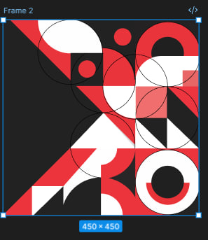

## PO-3: Working with Simple Shapes and Their Properties in Figma  
### Creating a Geometric Pattern  

**Work Plan:**  
- First, I chose the most pleasing pattern from the assignment.  

- Then I created a 450 × 450 frame and designed my own pattern using simple shapes.  

**Conclusion:**  
This composition in Figma demonstrates the use of geometric abstraction, balance, and contrast through bold shapes and a limited color palette.  
The combination of circles, triangles, and rectangles creates a dynamic visual rhythm, showing how simple forms can convey complexity and modern design aesthetics.

https://www.figma.com/design/2kxWjsUmk3Ss182owAFeeg/dz2?node-id=3-44&t=KMHKaBiJNZkOihzu-1