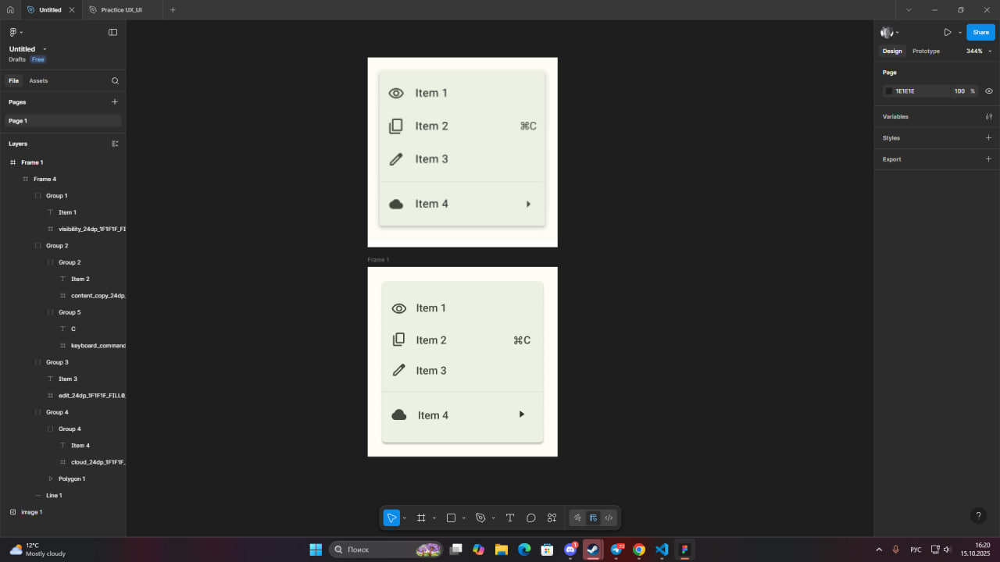

## PO-4: Working with Auto Layout and Components in Figma
### Creating a UI Menu Component

**Work Plan:**
- First, I created a primary frame to act as the container for the menu component.
- I designed a single menu item, combining an icon, a text label, and additional signifiers (like a keyboard shortcut or an arrow). I used **Auto Layout** to ensure the elements within each item were perfectly aligned and would remain responsive.
- I then assembled four unique menu items into a vertical list, using Auto Layout on the parent frame to manage the spacing between them automatically.
- Finally, the entire menu was converted into a single component. I applied styling such as a background color, rounded corners, and a drop shadow to give it a clean, modern look. The image below shows the final component and its layers.

**Conclusion:**
This project demonstrates the power of Auto Layout and components for building scalable and consistent user interfaces in Figma. By using Auto Layout, the menu items are flexible and can easily adapt to different content without manual adjustments. Turning the finished menu into a component makes it reusable throughout a design, ensuring that any future changes can be made once and applied everywhere. This workflow is fundamental to efficient and professional UI design, promoting consistency and saving significant time.

https://www.figma.com/design/6JFfNrShDXr7F7GqtxHrOs/Untitled?node-id=0-1&t=KGum9Fswqwaw4bHx-1