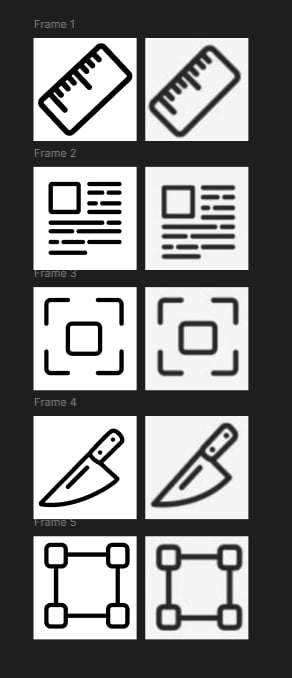

## Practical Work: Creating Icons in Figma

### Process
- Used the **Pen Tool** to draw outlines and shapes.  
- Created **vector icons** (ruler, text blocks, frames, knives, connection nodes).  
- Applied **Stroke** and **Fill** to highlight elements.  
- Adjusted **line thickness** and **symmetry** for a consistent visual style.  

### Conclusion
This work helped me strengthen my skills with the **Pen Tool** and taught me how to accurately create **vector elements and icons** in Figma.

https://www.figma.com/design/ncfo3vXl1z1XlTdFfqF4xS/Untitled?node-id=0-1&t=VhJkjzJVOxH3SULq-1