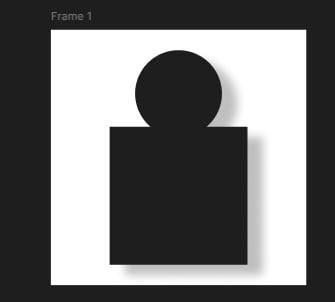
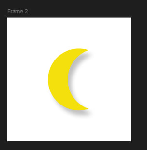
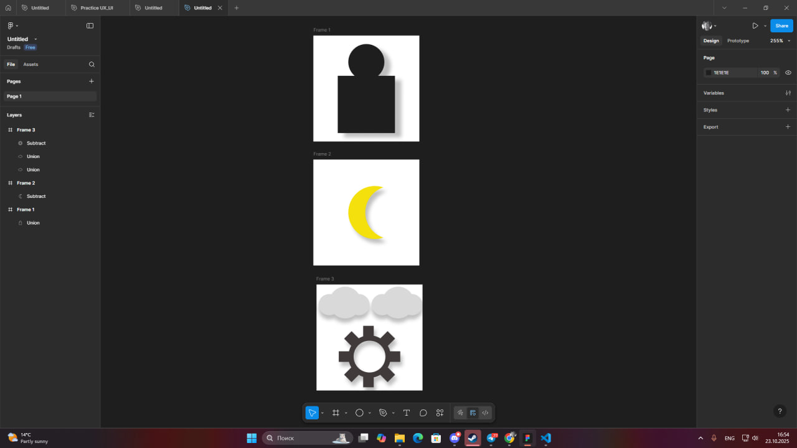

## 🧩 Creating a Set of Icons Using Boolean Operations

### 🔹 Work Process

#### 1. Creating the "User" Icon (Frame 1)
**Operation:** Union  

Two simple vector objects were created: an **Ellipse** (for the head) and a **Rectangle** (for the body).  
The ellipse slightly overlapped the top of the rectangle.  
Both shapes were selected and combined using the **Union** Boolean operation.  

**Result:**  
The two separate shapes merged into a single, solid silhouette representing a user.

---

#### 2. Creating the "Moon" Icon (Frame 2)
**Operation:** Subtract  

Two **Ellipses** were created — one slightly smaller than the other.  
The smaller ellipse (“knife”) was placed over the larger one (“base”) so that the visible part of the base formed a crescent shape.  
Both shapes were selected, and the **Subtract** Boolean operation was applied.  

**Result:**  
The top ellipse cut its shape out of the bottom one, creating a clean crescent moon icon.

---

#### 3. Creating the "Cloud" Icon (Frame 3, top)
**Operation:** Union  

A set of shapes was created: one **Rounded Rectangle** (for the cloud base) and three **Ellipses** of different sizes (for the domes).  
The shapes were arranged to partially overlap each other and the top part of the rectangle.  
All figures were selected and combined using the **Union** operation.  

**Result:**  
A group of separate “bubbles” merged into a single, recognizable cloud shape.

---

#### 4. Creating the "Gear / Settings" Icon (Frame 3, bottom)
**Operations:** Union and Subtract  

**Step 1 (Teeth creation):**  
One **Circle** (base) and eight **Rectangles** (teeth) were evenly arranged around it.  
All nine objects were merged using the **Union** operation.  

**Step 2 (Hole creation):**  
A smaller **Ellipse** was created as the center hole.  

**Step 3 (Cutting):**  
The smaller ellipse was placed in the center of the gear and used with the **Subtract** operation.  

**Result:**  
A complex solid gear icon was created with a transparent hole in the center.

---

### 💡 Conclusion
During this work, the key vector design technique — **Boolean operations** — was mastered.  
This approach allows for creating visually complex, clean, and technically precise icons using only basic geometric primitives (circles and rectangles).  

The main advantage of this method lies in **non-destructive editing**: a Boolean group (like “Union” or “Subtract”) remains a container that allows modifying the size, color, or position of the original shapes at any time.  
This makes the design process **flexible, fast, and efficient**.

https://www.figma.com/design/QfzS6r778uarTYXyJy8abx/Untitled?node-id=0-1&t=5f4hfYvBZYbnsf3L-1