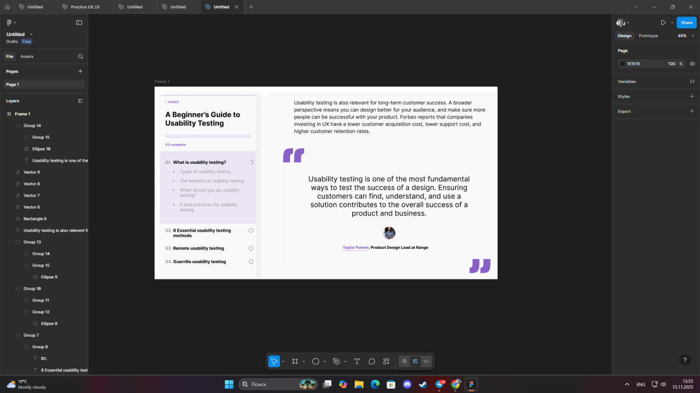

# **Practical tasks 7–8. Typography in interface design (Parts 1–2)**

## **Work process**

The purpose of these tasks was to **explore how typography influences readability and visual hierarchy** in user interface layouts and to apply this theory through practical exercises in **Figma**.

In **Part 1**, I studied the material from  
[*Typography — Figma User Guide, sections 9–10*](https://docs.google.com/document/d/1IAKGCHHd1mB2Ecz_xdSHvbygmMeIOiWp-nQBAQz_JlY/edit?usp=sharing),  
focusing on the key principles of **font hierarchy, spacing, contrast, and legibility**.  
I also reviewed the following concepts:  
- **Kerning** — spacing between individual letter pairs;  
- **Tracking** — uniform spacing across all characters;  
- **Leading** — vertical distance between lines of text;  
- **Hierarchy** — the system that defines text importance through size, weight, and placement.  

In **Part 2**, using the tutorial  
[*Typography in UI Design (YouTube)*](https://www.youtube.com/watch?v=VouVsut_-Ak),  
I recreated a **Figma layout focused on usability testing**, ensuring typographic consistency and alignment across all elements.

The layout includes:  
- **Left panel** — navigation section with progress indicators, subtitles, and typographic hierarchy;  
- **Right panel** — main article text with proper paragraph rhythm and an emphasized quote block.

The main focus was to maintain **balance, alignment, font pairing**, and **visual rhythm** for a clean, professional look.

---

### **1) Usability Testing Typography Layout**

---

### **File path in repository**
https://www.figma.com/design/87htqiFOtmwKiayg2Os0Ia/Untitled?node-id=0-1&t=iQGiwFKyj3veMrpF-1

---

## **Conclusions**

Through these exercises, I learned how **typography defines the tone and clarity of digital interfaces**.  
Working in Figma helped me practice **text alignment, hierarchy, kerning, and contrast**, ensuring both readability and aesthetic harmony.  
This task demonstrated that typography is not just decorative — it’s a crucial element of **user experience** and **visual communication**.

